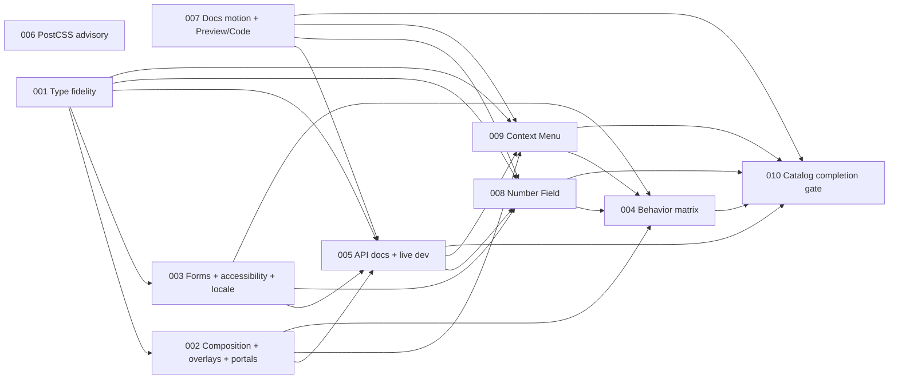

# coss-svelte implementation roadmap

This directory is the single execution roadmap for the 2026-07-28 repository
audit and the remaining-component work. The former “remaining components”
overview has been superseded by this index; plan IDs below are unique and all
dependencies name exact files.

Plan IDs are stable references, not a strict numeric execution order. Follow
the dependency graph and update both the selected plan and this table when its
status changes.

## Working-tree baseline

- Planned against commit
  `aced7142d97c241fb8cf62d613b72f819f883476`.
- The worktree already contains user-owned Alert Dialog and docs motion work;
  Preview/Code and production-crawl changes; full uncommitted Number Field and
  Context Menu vertical-slice spikes; and catalog/clean-consumer gate
  scaffolding.
- Plans 002, 007, 008, 009, and 010 overlap those files. Their first step is
  reconciliation: inspect the live diff, compare it with the approved contract,
  and keep correct work instead of replaying the original proposal. Passing
  narrow spike/catalog checks does not make those plans complete.
- Executors must not regenerate scope or registry output until overlapping
  source and metadata edits have been reconciled.

## Findings and decisions

| ID | Finding or direction | Evidence and decision | Impact | Confidence |
|---|---|---|---|---|
| F01 | Primitive wrapper types erase supported Bits UI contracts | About 68 primitive-backed parts use generic `NativeProps`; representative generated declarations omit primitive refs, bindings, child composition, form props, or precise element attributes. Derive each wrapper from its exact Bits part and preserve only composition capabilities the wrapper intentionally supports. | Published declarations reject valid use and admit invalid combinations. | High |
| F02 | Mode-dependent roots flatten discriminated unions | Accordion, Calendar, Slider, Select, Combobox, Autocomplete, and ToggleGroup independently union mode, value, and callbacks. Restore single/multiple branches and retain upstream types such as Slider’s scalar/array `step`. | Illegal prop combinations compile and useful primitive behavior disappears. | High |
| F03 | Concrete declaration defects exist | Switch omits primitive form props and Pagination exposes an `unknown` snippet payload. Native polymorphic roots also need a bounded element-attribute audit. | Forms and custom rendering are incorrectly typed. | High |
| F04 | One global composition label cannot describe the package | Compound children, convenience-content children, payload snippets, and intentionally additive children are different APIs. Collapsible and Sidebar prove that a blanket “children always replace convenience props” migration would be wrong. Replace the global assumption with an explicit per-root composition classification and test each class. | A naive consistency fix would create breaking changes; today’s docs still over-promise uniformity. | High |
| F05 | Portal forwarding is promised but absent | Portaled popup wrappers hardcode Bits portals. The installed Bits UI 2.18.1 portal contract is `{ to?: Element \| string, disabled?: boolean }`; React-only `container` and `keepMounted` names must not enter the Svelte API. | Consumers cannot choose a shadow root, test host, or inline rendering. | High |
| F06 | Alert Dialog outside dismissal has two competing paths | The live dirty work combines `interactOutsideBehavior="close"` with direct overlay `onclick` and a string-keyed close context. Keep one Bits-owned dismissal path, preserve caller cancellation semantics, and test one state transition plus focus restoration. | Duplicate close callbacks and contradictory public behavior are possible. | High |
| F07 | Form, name, and locale contracts are inconsistent | Radio Group’s convenience label is unassociated, Select’s public ID does not reach its trigger, and Date Picker formats with fixed `en-US` while its primitive can use another locale. | Accessible names, Field wiring, localized output, and serialization can be wrong. | High |
| F08 | Runtime verification is narrower than the published surface | Current browser smoke primarily proves docs shell behavior; many repository tests are source-shape assertions. Add a metadata-covered family matrix and real browser interaction fixtures without duplicating every styled alias. | Focus, keyboard, portal, form, and dismissal regressions can pass release checks. | High |
| F09 | API docs hide inherited contracts | The API table substitutes `...rest: Record<string, unknown>` for primitive/native props. Generate listed prop types and bindings from built declarations while keeping inherited long tails as precise source links. | Users cannot discover supported bindings, snippet payloads, refs, form props, or portal props. | High |
| F10 | Docs development can serve stale package output | The docs app imports `coss-svelte` from generated `dist`, while its `dev` script starts only Vite. Add one root command that performs an initial package build, then watches package and docs together. | Correct source edits can look broken during development. | High |
| F11 | The locked graph contains a high-severity PostCSS advisory | `pnpm audit --audit-level high` reports GHSA-r28c-9q8g-f849 for PostCSS 8.5.15. Patched versions start at 8.5.18; current PostCSS is 8.5.23 and Vite 8.1.5 accepts `^8.5.17`. Use the smallest durable lock/override change, not a broad toolchain migration. | Known source-map path disclosure remains in the build graph. | High |
| F12 | Built component routes previously lost example source | Runtime filesystem reads resolve beside adapter-node chunks, not source examples. The live worktree already contains the correct eager `?raw` Vite bundle direction; finish and prove it on built HTML and Markdown routes. | Docs smoke can pass while every component route fails. | High |
| F13 | Introduction established a subtle entrance that other sidebar pages lacked | The live worktree now applies the same fade/rise keyframes through shared page wrappers, but route-keying and reduced-motion behavior are not browser-proven. Keep motion at top-level content blocks and verify replay only on navigation. | Navigation otherwise feels inconsistent, while over-applying the animation would make long docs distracting. | High |
| F14 | "On This Page" links jumped instantly | The live DocsToc now intercepts unmodified hash clicks with reduced-motion-aware `scrollIntoView`, but history, offset, progressive fallback, and real motion remain untested. | In-page navigation feels abrupt or can regress native anchor semantics. | High |
| D01 | Number Field was the only registered deferred root at the audit baseline | Bits UI 2.18.1 has no Number Field. The live full implementation spike may be promoted only behind an explicit numeric, locale-editing, spinbutton, form, SSR, cleanup, and interaction contract. Eleven upstream particles exist. | This is a large custom primitive, not a styling task; current source/tests require reconciliation in plan 008. | High |
| D02 | Context Menu was acknowledged but absent from baseline catalog metadata | Bits UI 2.18.1 supplies right-click, long press, roving focus, items, submenus, and portal behavior. Reconcile the live complete 15-export spike without reproducing those internals, and add only the missing keyboard/directional wrapper behavior. | Catalog completion otherwise either omits the newer root or overstates an unverified spike. | High |
| D03 | “All components implemented” needs a durable join across surfaces | Package source, generated index/declarations, example source, registry closure, built HTML/Markdown routes, and clean-consumer installation can drift independently. Add a cross-surface catalog gate after the behavior plans. | A green typecheck alone cannot prove a shippable catalog. | High |

## Execution graph

Plan 006 is an independent security lane. Plans 007–010 contain substantial
live implementation, but each remains in progress until its own acceptance
criteria—not only the current narrow checks—are satisfied.

## Recommended execution waves

1. Run 006 independently, and reconcile/finish 007 while the component API
   lane begins with 001.
2. After 001, execute 002 and 003; these establish the composition, overlay,
   portal, Field, form, and locale contracts used downstream.
3. Execute 005 after 002/003/007 so generated API facts reflect corrected
   declarations and the docs runtime is live.
4. Reconcile 008 and 009 against their explicit contracts after their
   prerequisites pass. They may proceed independently of one another.
5. Build the family-wide behavior/evidence matrix in 004 only after both new
   families have final contracts.
6. Finish with 010 as the sole cross-surface release join.

## Status

| Plan | Title | Priority | Effort | Exact dependencies | Status |
|---|---|---:|---:|---|---|
| [001](001-restore-bits-ui-type-fidelity.md) | Restore Bits UI type fidelity | P1 | L | — | DONE |
| [002](002-coherent-composition-overlays-portals.md) | Define composition, dismissal, and portal contracts | P1 | L | 001 | DONE |
| [003](003-form-accessibility-locale-contracts.md) | Close form, accessible-name, and locale gaps | P1 | M | 001 | DONE |
| [004](004-component-family-behavior-verification.md) | Add component-family behavior verification | P1 | L | 002, 003, 008, 009 | DONE |
| [005](005-truthful-api-docs-and-dev-loop.md) | Generate truthful API docs and a live dev loop | P2 | M/L | 001, 002, 003, 007 | DONE |
| [006](006-remove-postcss-security-advisory.md) | Remove the PostCSS advisory | P1 | S | — | DONE |
| [007](007-preview-and-code-infrastructure.md) | Harden docs motion, in-page navigation, and Preview/Code | P0 | M/L | — | DONE |
| [008](008-implement-number-field.md) | Implement Number Field | P1 | XL | 001, 003, 005, 007 | DONE |
| [009](009-implement-context-menu.md) | Implement Context Menu | P1 | L | 001, 002, 005, 007 | DONE |
| [010](010-catalog-completion-gate.md) | Enforce catalog completion | P0 release | M | 004, 005, 007, 008, 009 | DONE |

Allowed status values are `TODO`, `IN PROGRESS`, `DONE`,
`BLOCKED: <reason>`, and `REJECTED: <reason>`. A qualifier after TODO or IN
PROGRESS may record reconciliation state, but must not hide a blocker.

## Execution protocol

Every plan has a local drift check, owned file set, ordered implementation
units, narrow verification commands, acceptance criteria, and STOP conditions.
In addition:

1. Preserve unrelated dirty files and re-read `git status --short` before any
   generator.
2. Execute one verifiable unit at a time. A unit is complete only when its
   listed focused check passes.
3. Derive public types from installed Bits UI/Svelte declarations; do not copy
   React/Base UI implementation source or prop aliases.
4. Generate package index, scope, and registry output only through repository
   scripts.
5. Run `pnpm release:check` only after focused failures are resolved.
6. Record commands and results in the implementation handoff. A manual visual
   review is evidence, not a substitute for deterministic gates.
7. Update this table and the selected plan’s status when work starts, stops, or
   completes.

## Deliberately excluded

- Drawer, Sidebar, and Toast remain experimental. These plans do not promote
  them or claim full upstream parity.
- No plan introduces React `asChild`, Base UI `render`, portal prop aliases, or
  copied React source.
- No plan performs a broad visual redesign, package-manager migration, or
  unrelated dependency refresh.
- Standalone Checkbox Indicator and full particle parity remain separate
  product-scope decisions.
